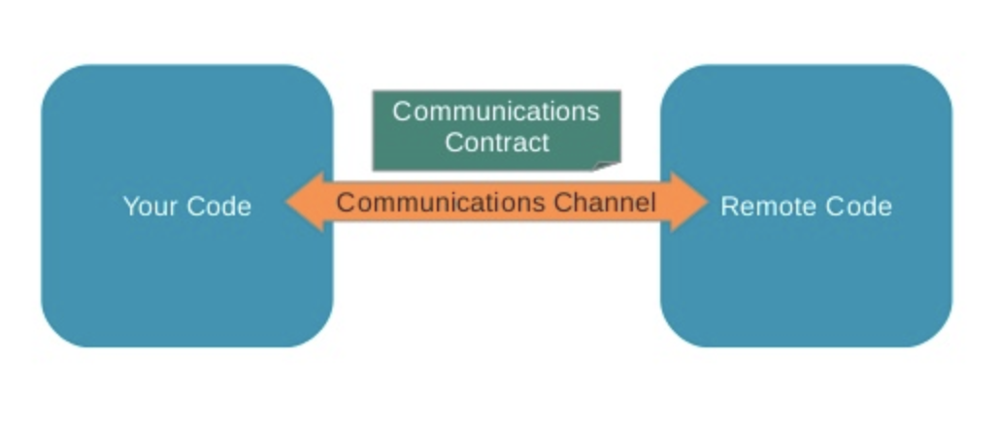
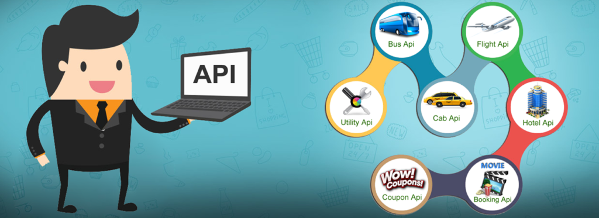
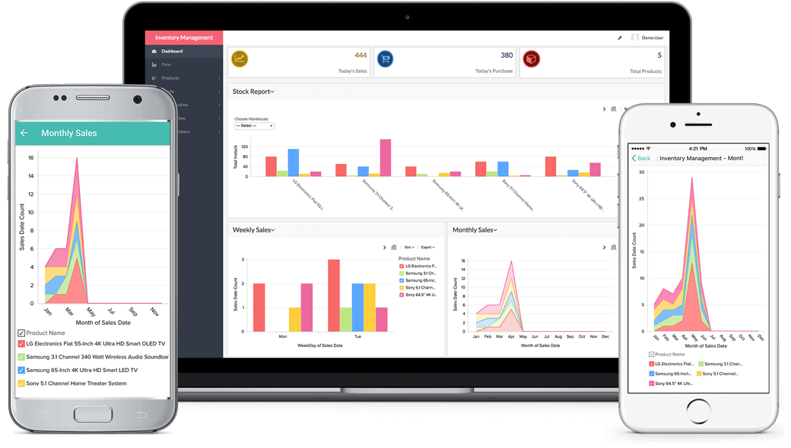
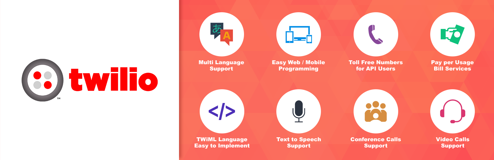

# Introduction to APIs

## Introduction 

APIs (Application Programming Interfaces) are an important aspect of modern living, in both professional as and personal contexts. From social media to business communications, planning a holiday to ordering products/services online, APIs are being used almost everywhere. However, users of APIs generally have a rather vague or incorrect idea about what this term means.

In this lesson, we provide an introduction to what an API is and how it works. We shall look at some types of APIs with real world examples of how businesses are using it to connect to their customers.

## Objectives
You will be able to : 
* Understand and explain what an API is
* Understand and explain why companies build APIs

## Application Programming Interface (API)

> API stands for **Application Programming Interface**. 

An API is a communication protocol between 2 software systems. It describes the mechanism through which if one system **requests** some information using a predefined format, a remote system **responds** with an outcome that gets sent back to the first system. 

So just like a GUI or command line based interaction in an operating system allows users to Interact with code that makes up the system, an API allows one piece of code to interact with other code. One of the most common use case for APIs is the communication on the Internet - information sharing on social media, financial transactions over the web, displaying list of tweets through a social handle – all of these services use API at the back. APIs are one of the most common ways technology companies integrate with each other. Those that provide and use APIs are considered as being members of a global business ecosystem. 

### What is meant by interaction between two applications?

Typically, an interaction occurs when one application would like to access the data held by another application, or send data to that application. Another interaction might be when one application wants to request a service from another.

A key thing to note: An API is not a user interface. It provides software-to-software interaction, not user interactions. Sometimes, though, an API may provide a user interface widget, which an app can grab and display.

Developers who want to build API based features in their code use an **API call** to implement complex features instead of having to code it by themselves. A good API makes it easier to develop a program by providing all the building blocks and a developer then puts the blocks together. An API may be for a web-based system, operating system, database system, computer hardware, or a software library.

### And what is an API call ?

Every time you make a request to a server running an API , the request (or the call) counts as an **API request** or **API call**. User authentications, data logging, requesting specific information from servers are examples of operations that are counted as API calls. For example, every time  you download a new app to your mobile and try to register using a name and password, as soon as you click the join/register/submit button, it is counted as one **API call**. Following this, every time you use that app to request existing data, submit new data, check data status etc, these are all examples of API calling. 

### Let's see a real example

Pokemon Go has been one of the most popular smartphone games, which requires a large ecosystem with complete information of routes and roads across the globe. Developers of the Pokemon could not have possibly coded such a complete world map. Instead, they used Google maps API and built their app on top of it. Following image shows the complete architecture that allows players of pokemon go to play a game which in turns responds by making geographical information related API calls to google maps.  

### What is an API made of ?

An API has three main components as listed below:

* **Access Permissions:** Is the user allowed to ask for data or services?
* **Request:** The service being asked for (e.g., if I give you current location using GPS, tell me the map around that place - as we see in Pokemon Go).  A Request has two main parts:

    * **Methods:** Once the access is permitted, what questions can be asked.
    
    * **Parameters:** Additional details that can be sent with requests or responses

* **Response:** The data or service as a result of the request.

We shall look at how to use these components in the upcoming lessons for this section. Let's move ahead for now and explore APIs a bit more in terms of their applications. 

## API Types

### Web-based API

A web API is an interface to either a **web server** or a **web browser**. These APIs can work both at the server end or the client end. Companies like Google, Amazon, eBay all provide web-based API. Some popular examples of web based API are:
* Twitter REST API
* Facebook Graph API
* Amazon S3 REST API

### Operating system (OS) based API 

OS based APIs allow functionality of various OS features that can be incorporated in creating windows or mac applications. Think about all the applications using a standard menu interface, buttons, navigation, general management etc. The developers simply build their applications on top of the interface/network/security features offered by the OS. Some of the examples of OS based API are Cocoa, Carbon, WinAPI, etc.

### Database APIs
Most interactions with a  database system take place using the API calls to the database. These APIs are defined in a manner to pass out the requested data in a predefined format that is understandable by the requesting client.
This makes the process of interaction with databases generalised and thereby enhancing the compatibility of applications with the  various database. They are very robust and provide a structured interface to database. Some popular examples are Drupal 7 Database API, Drupal 8 Database API, Django API.

### Hardware APIs
These APIs allows access to the various hardware components of a system. They are extremely crucial for establishing communication to the hardware. Due to which it makes possible for a range of functions from the collection of sensor data to even display on your screens.

For example, the Google PowerMeter API will allow device manufacturers to build home energy monitoring devices that work with Google PowerMeter. Other examples of Hardware APIs are: QUANT Electronic, WareNet CheckWare,OpenVX Hardware Acceleration, CubeSensors, etc.

For the rest of this section , we shall focus on web APIs which are mainly used for data and information dissemination. 

## Business Applications of APIs

Businesses use APIs to develop a stronger relationship with their customers by offering them with easy ways to share and access information , transactions and also to achieve a competitive advantage. Looking at the growing use of APIs, it is becoming more of a survival technique for businesses. 

### Mobile-ready Business

As mobile platforms and applications have evolved over last decade, businesses face a new challenge to make their services "mobile ready" in order to meet customers' expectations . Applications now need to be available in multiple versions for multiple operating systems and devices — Android, iOS, Windows Phone, or even next-generation non-mobile devices such as Smart TVs. Businesses now develop and maintain process in a way that affects not only the various user interface components, but also the communication channels. Securing this "data channel" and keeping it uniform has become one of the most important uses of APIs. More companies are now designing APIs for consistent data experiences across platforms to provide the specifics for each audience.

### Developing Business Ecosystems

Another challenge for data driven organizations is to serve special needs that vary with customers. Customers should be able to customize the products/services according to their own needs and expectations. In addition, it's often the case that partner organizations can provide valuable complementary services to enhance an offering. In both of these cases, customers and partners need to integrate their systems to the company they are doing business with. This allows a business to "become a platform" like amazon and ebay. Both these companies use APIs as the foundation for a powerful partner ecosystem, and even non-technical companies such as Nike are using APIs to enable a third-party ecosystem to emerge.

### Accelerating Reach for Content and Transactions

APIs are used as an accelerator for content distribution and enabling transactions from a wide variety of sources. For media and content related businesses, providing API access to content that partners, news readers, aggregators and mashup tools can automatically access and propel to new audiences. For on-line as well as traditional businesses, APIs enable purchase transactions with much wider set of interfaces than a standard website would. An example aggregator in the media case is Flipboard.

Flipboard pulls in content via API from a wide variety of sources. Having an accessible API allows it to be accessible to the Flipboard users. On the online sales, companies such as Walgreens now have APIs that enable prescription filling and submission of photos for printing. This enables third-party developers to embed such features wherever and whenever it is convenient for the user.

### New Business Models

Pure-play API companies such as Twilio and Sendgrid have shown that APIs can be used as products themselves, rather than a tool for strengthening business operations. These companies offer APIs to other companies for the operations. So in essence, a start-up wouldn't have to worry too much about setting up an API for their business processes. Twilio can offer these services out of the box including language support, financial transactions, multi-platform enabling etc. Following images shows some of the services offered by Twilio.| 

While this does not apply to all companies, enabling and delivering a valuable API service to third-party developers and partners has clear revenue potential. Furthermore, if successful, this strategy has the potential to become an element of core infrastructure for its users and hence create strong partner relations and an ecosystem of third-party tools.

### Internal Innovation

In modern business landscape, large companies continuously need to innovate and develop new state of the art internal and customer-facing systems. APIs offer the key to providing the agility needed to do this. Amazon's Jeff Bezos famously enforced all software in the company to interact only via APIs from 2004 onwards. This move is widely credited as key to Amazon's ability to later offer new business models such as AWS computing services, Alexa voice assistant etc. APIs are key in providing packaged, accessible interfaces to systems all across an organization and reducing the friction in creating new, cross-organizational systems.

## Summary

In this lesson, we looked at an introduction to APIs, their basic understanding and main types of APIs. We also looked at how companies use APIs to grow their businesses, develop an improved customer and partner relation, develop new business models and drive innovation. In following lessons, we shall look into this in a bit more detail along with how to make API calls in python. 
